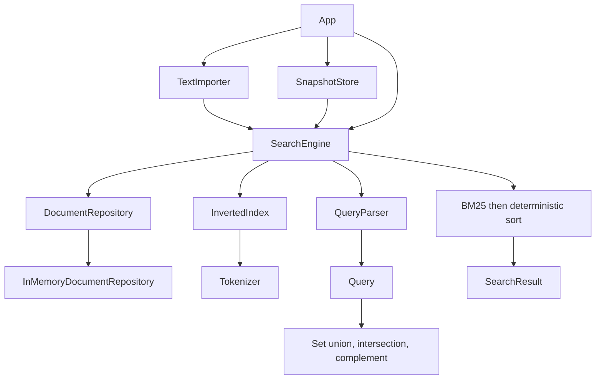

# How AsterSearch fits together

The easiest place to start is `SearchEngine`. It owns the original documents and the index used to find them. The CLI, importer and snapshot code all work through that engine.

## Follow a document into the engine

When you add a document, `SearchEngine` checks that its ID isn't already in use before adding it to the index and repository. Keeping those two structures together is its main job. It doesn't expose a writable index: callers get immutable documents and results, along with fresh collections of IDs.

The repository keeps the full text. `InMemoryDocumentRepository` stores immutable `Document` records in a hash map behind the existing add/find/count API. When the engine needs an ordered list, it gets the known IDs from the index and looks up the corresponding records. There's no separate repository method for listing every document.

The index answers a different question: which documents contain this word, and how often? Its `Map<String, Map<Integer, Integer>>` maps each word to document IDs and frequencies. The inner keys give membership; the values give counts. Another map holds each document's length, including zero for a document with no tokens. A running total supplies the average length used by BM25. Word positions aren't stored.

This arrangement assumes one thread. It doesn't provide transactions if memory runs out partway through an addition, or protect against concurrent changes.

## Follow a query back out

`QueryParser` reads the query and builds a tree. Each node represents a word, AND, OR or NOT. That lets parsing decide the meaning before the engine looks at any documents.

One input word can produce several tokens. For example, `İSTANBUL` becomes `i` and `stanbul`. The parser puts both inside one AND subtree, so `NOT İSTANBUL` negates the whole group: `NOT (i AND stanbul)`.

The same tree has two ways to evaluate a query. Indexed matching combines sets of document IDs. The benchmark scans instead ask whether each document contains a word, then apply the tree's Boolean operations. Both scanning baselines share the parser with the index. Tests with explicit expected answers help check that shared parser separately. The pretokenized scan also keeps its own word set for each document, outside the engine.

Once matching finishes, `SearchEngine` calculates BM25 and sorts all the results. Frequencies and average length come from the whole collection. BM25 stays in a private method because there's only one ranking policy at present. There's no query planner or heap for keeping just the best results: even a small display limit still means scoring and sorting every match.

## What goes into a snapshot

Version 1 uses a simple binary layout. Integers are signed, use 32 bits and put the most significant byte first, as `DataOutputStream` does. Strings start with a byte length followed by UTF-8 bytes. This isn't the modified UTF-8 format used by Java's `writeUTF`.

| Order | Field |
| --- | --- |
| 1 | Magic value, 4 bytes: `0x41535452` (ASTR) |
| 2 | Version, 4 bytes, currently 1 |
| 3 | Payload length in bytes, stored in 4 bytes (at most 128 MiB) |
| 4 | SHA-256 of payload, 32 bytes |
| 5 | Payload: document count; each ID, title, content in ascending ID order |
| 6 | Within payload: document lengths in that same order |
| 7 | Within payload: term count; each term in String order, posting count, then ID/frequency pairs in ascending ID order |

The envelope takes 44 bytes. Documents, terms and postings are saved in a fixed order so the same collection produces the same snapshot bytes.

`SearchEngine.writeIndex` writes the internal statistics and calls `SnapshotStore.writeText` for string encoding. If more formats are added, those shared details could move into a separate codec or an immutable export object.

## Why loading rebuilds the index

The loader first checks the header, version and length. It reads the payload, rejects trailing bytes and checks the digest. Document decoding then enforces valid UTF-8 and sorted, unique IDs.

Rather than install the saved postings, it adds the decoded documents to a new engine. It serializes that rebuilt engine in the same fixed order and compares every byte with the original payload. That checks all the saved lengths and postings without needing a second decoder for index data. You only get the engine back after all checks pass.

The benefit is a straightforward consistency check. The cost is doing the indexing work again and holding several byte arrays while loading. A snapshot is useful for persistence, but this implementation doesn't promise faster startup than rebuilding.

## What saving does and doesn't guarantee

Saving writes a temporary file and atomically replaces the destination. An ordinary write failure therefore doesn't leave a partly written snapshot in its place. If the filesystem can't replace it atomically, the save fails.

Files and folders aren't explicitly fsynced, so this doesn't guarantee survival after a power loss. A snapshot also doesn't authenticate its contents. It's a local application file with checks for corruption and consistency.

## Where the design could go next

Java strings, boxed integers and hash maps keep the code easy to follow, but use more memory than packed data. Large inputs can exhaust the heap before the save size check runs. There are no guarantees of bounded resource use for hostile files.

The engine doesn't yet stream or compress its data, update the index incrementally or support concurrent writes. Compressed postings, bounded input streaming and direct restoration of a saved index would be useful areas to explore. Stable external document keys and format migrations would also matter as the project grows. Changing tokenization or index encoding requires a new format version or a migration.
